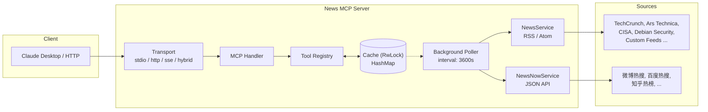

# Architecture

> **Fork** of [KingingWang/news-mcp](https://github.com/KingingWang/news-mcp).  
> This document covers the forked version with custom feed categories and config-driven sources.

## Overview

News MCP Server is a Rust implementation of the Model Context Protocol (MCP) that fetches, caches, and serves news articles from RSS feeds. It runs as a background-polling service and exposes three MCP tools for AI assistants (Claude Desktop, etc.).

### What Changed in This Fork

| Aspect | Original | This Fork |
|--------|----------|-----------|
| Categories | Fixed enum (30+ variants) | Enum still exists for builtins; `Custom(String)` variant for user-defined feeds |
| Feed URLs | Hardcoded in `get_feed_urls()` | Merged from config `[feeds.*]` + built-in defaults |
| New feeds | Requires new enum variant + code change | Just add `[feeds.my-feed]` to `config.toml` |
| Poller startup | Blocks server startup | Starts immediately; cache fills on first poll tick |
| NewsNow integration | Separate tool | Unified under same `get_news`/`get_categories` tools |

## Component Diagram



**Flow:**
1. Client request → Transport → Handler → Tool Registry reads from Cache
2. Cache miss → Poller triggered → NewsService / NewsNowService fetch → Cache updated
3. Poller runs on background interval, never blocks startup

### Resolution Strategy
1. Builtin enum variants (Technology, Science, etc.) always exist
2. Config keys that match builtin aliases resolve to builtin
3. Unknown config keys → `NewsCategory::Custom(key)`
4. Custom categories appear after first successful poll cycle
</pre>

## Core Components

### 1. Cache Layer (`src/cache/`)

**In-memory only — no persistence to disk.**

The server runs two independent in-memory caches:

| Cache | Struct | Key | Value | Scope |
|-------|--------|-----|-------|-------|
| **NewsCache** | `RwLock<HashMap<NewsCategory, Vec<NewsArticle>>>` | NewsCategory (enum) | List of articles | Per-category article index |
| **ArticleCache** | `RwLock<HashMap<String, CachedArticle>>` | URL (String) | Full content + metadata | Per-URL full text |

Both use `RwLock` (multiple concurrent readers, single writer) — all MCP tools read, only the background poller writes.

#### NewsCache

Articles stored by category, with a **hard cap per category** (`max_articles_per_category`, default 100). When the poller inserts a new batch, it takes only the first N articles. There is **no eviction** — the poller atomically replaces the entire category's list on each cycle.

```rust
pub struct NewsCache {
    articles: RwLock<HashMap<NewsCategory, Vec<NewsArticle>>>,
    last_updated: RwLock<HashMap<NewsCategory, DateTime<Utc>>>,
    max_articles_per_category: usize,
}
```

Each `NewsArticle` holds **metadata only** on initial fetch (title, description, link, source, published_at). The `content` field starts as `None` — it is filled **lazily** when `get_article_content` is called for the first time.

**Cache methods:**
- `get_category_news(&Category) -> Vec<NewsArticle>` — read articles for a category
- `set_category_news(Category, Vec<NewsArticle>)` — write articles (truncates to `max_articles_per_category`)
- `get_all_categories() -> Vec<(Category, usize)>` — returns builtins (with counts) + any Custom categories that have cached data
- `search(query, Category?) -> Vec<NewsArticle>` — full-text search over title/description

#### ArticleCache

Full article text, cached by URL. Introduced in `src/cache/article_cache.rs`.

```rust
pub struct ArticleCache {
    articles: RwLock<HashMap<String, CachedArticle>>,
    max_articles: usize,
}
```

Where `CachedArticle` stores:
- `content: String` — cleaned plain text extracted from article HTML
- `fetched_at: DateTime<Utc>` — when the content was fetched (used for eviction)
- `word_count: usize` — computed on insertion

**Lazy content loading:** When a client calls `get_article_content(id)`, the server first checks the ArticleCache by resolved URL. On miss, it fetches the HTML, extracts text content, stores it in **both** caches (ArticleCache by URL, and back into the NewsArticle's `content` field), then returns it. On subsequent calls, returns from cache instantly.

**Eviction policy (FIFO by age):** When the cache is full (`max_articles`, default 100) and a new URL is inserted, the oldest entry (by `fetched_at`) is evicted to make room. This is a bounded LRU-like policy — once fetched, content stays until the cache fills and a newer URL displaces it.

#### What Happens on Restart

| Step | State |
|------|-------|
| Server starts | Both caches are **empty** |
| First poll cycle completes | NewsCache populated with article metadata (titles, descriptions). ArticleCache still empty |
| First `get_article_content` call for a URL | ArticleCache populates that URL |
| Server restarts | **Everything lost**. Both caches start from empty |

This means:
- Before the first poll cycle (up to `interval_secs`, default 60s for initial poll), `get_news` returns 0 articles for all categories
- After restart, all previously fetched full content is gone — `get_article_content` re-fetches from source
- A **second poll cycle** (first refresh) is **not** needed — the initial poll already fills the cache

#### Persistence Design Decision

**Why no disk storage?** Simplicity and resource footprint. The MCP server is meant to run alongside an AI assistant session — ephemeral by nature. RSS feeds are polled hourly, so at most one hour of content is "lost" on restart. Full article content would require a bounded SQLite database with cleanup logic, adding complexity for marginal gain given the use case.

If persistence becomes necessary, the recommended approach is:
1. Add optional SQLite via `rusqlite` behind a `NewsCache` trait
2. Enable via config flag `cache.backend = "sqlite"` / `"memory"`
3. Both backends share the same interface — swap at startup

### 2. Background Poller (`src/poller/`)

An async task that periodically calls every registered `NewsSource` and writes results into the cache.

```rust
pub trait NewsSource: Send + Sync {
    fn name(&self) -> &str;
    async fn fetch(&self) -> Result<HashMap<NewsCategory, Vec<NewsArticle>>>;
}
```

**Registered sources:**
1. **NewsService** (`src/service/news_service.rs`) — RSS/Atom feeds
2. **NewsNowService** (`src/service/newsnow_service.rs`) — Chinese hot lists via JSON API

The poller does **not block server startup**. The cache is initially empty; clients see 0 articles until the first poll cycle completes.

### 3. NewsService (`src/service/news_service.rs`)

Fetches RSS/Atom feeds. **This is where custom categories get wired in:**

```rust
async fn fetch_all_categories(&self) -> Result<HashMap<NewsCategory, Vec<NewsArticle>>> {
    let mut categories = NewsCategory::builtin();

    // Add custom categories from config
    if let Some(config) = &self.config {
        for key in config.feeds.keys() {
            let cat = NewsCategory::from_config_key(key);
            if matches!(cat, NewsCategory::Custom(_)) && !categories.contains(&cat) {
                categories.push(cat);
            }
        }
    }

    // Fetch all concurrently...
}
```

Each category gets its feed URLs from the config (or falls back to built-in defaults).

### 4. NewsNowService (`src/service/newsnow_service.rs`)

Fetches Chinese trending/hot lists from `newsnow.com` JSON API. 11 built-in sources. These are read-only feeds (no content fetch).

### 5. Config Layer (`src/config/`)

TOML-based configuration loaded at startup. Environment variables override individual fields.

```toml
[feeds.my-custom-feed]
display_name = "My Feed"
description = "Optional description"
urls = ["https://example.com/rss"]
enabled = true
```

The key (`my-custom-feed`) becomes a `NewsCategory::Custom("my-custom-feed")`.  
`display_name` and `description` override the auto-generated ones from `NewsCategory`.

### 6. Tools (`src/tools/`)

Three MCP tools, all registered in `ToolRegistry`:

| Tool | Function |
|------|----------|
| `get_news` | Fetch articles by category. Dynamic enum — custom categories appear in schema |
| `get_categories` | List all categories (builtin + custom) with article counts |
| `get_article_content` | Fetch full article text by ID (RSS sources only) |

## Configuration Reference

### Full config.toml structure

```toml
[server]
name = "news-mcp"
version = "0.1.0"
host = "127.0.0.1"
port = 8080
transport_mode = "stdio"   # stdio | http | sse | hybrid

[poller]
enabled = true
interval_secs = 3600       # seconds between poll cycles

[cache]
max_articles_per_category = 100

[article_fetch]
fetch_timeout_secs = 10

[logging]
level = "info"             # trace | debug | info | warn | error
enable_console = true

# Custom feed sources — each key becomes a NewsCategory::Custom
[feeds.my-feed]
display_name = "My Feed"   # optional; shown in get_categories output
description = "..."        # optional; shown in tool descriptions
urls = ["https://.../rss"] # required: list of RSS/Atom feed URLs
enabled = true             # optional, default: true
```

### How categories are resolved

1. Built-in enum variants (Technology, Science, etc.) always exist
2. Config keys that match a builtin alias (`tech` → Technology) resolve to the builtin
3. Unknown config keys become `NewsCategory::Custom(key)`
4. Custom categories appear in `get_categories` only after the first poll cycle that caches data

## How to Add a New Feed (No Code)

1. Add `[feeds.your-feed-name]` to `config.toml`
2. Set `urls = ["https://example.com/rss"]`
3. Restart the server

That's it. No recompilation, no enum variants, no code changes.

The category key (lowercase, alphanumeric + hyphens/underscores) becomes the identifier used in `get_news` calls.

## Testing

```bash
cargo test                    # All tests
cargo test --test unit        # Unit tests (cache, service, tools, config)
cargo test --test e2e         # Integration tests (HTTP/stdio transport)
```

66 tests total, ~1.2s runtime. Tests validate:
- Custom category resolution from config
- Builtin ↔ config key mapping
- Cache read/write/search
- Tool execution paths
- NewsNow API deserialization

## Tech Stack

| Layer | Technology |
|-------|-----------|
| Language | Rust 1.75+ |
| Async runtime | tokio |
| HTTP client | reqwest + reqwest-middleware |
| RSS parsing | feed-rs |
| MCP protocol | rust-mcp-sdk |
| Serialization | serde + toml |
| Logging | tracing + tracing-subscriber |
